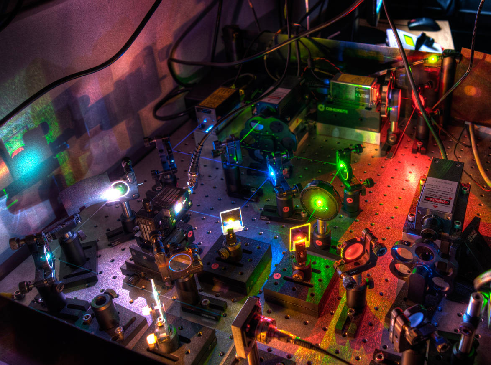

My biophysics phd was focused on single molecule fluorescence methods for studying DNA-protein interactions. 

A bit more specifically I used single molecule methods such as FRET (Forster resonance energy transfer), PIFE (protein induced fluorescence enhancement), and a method I developed, TFM (tethered fluorophore motion), to study a range of DNA processing proteins (DNA polymerase, recombinases, and motor proteins).

This was where I first started to write code in earnest, learnt the appeal of building tools and methods, started processing images, and got to play with lasers.

<video controls src="microscope-building.mp4" loop="true"></video>

Here are the papers I published back then:

- [Capturing reaction paths and intermediates in Cre-loxP recombination using single-molecule fluorescence](Capturing reaction paths and intermediates in Cre-loxP recombination using single-molecule fluorescence.pdf)
- [Conformational transitions during FtsK translocase activation of individual XerCD–dif recombination complexes](Conformational transitions during FtsK translocase activation of individual XerCD–dif recombination complexes.pdf)
- [Extending and combining single molecule methods to study site specific recombination](Extending and combining single molecule methods to study site specific recombination.pdf)
- [Rotavirus mRNAS are released by transcript-specific channels in the double-layered viral capsid](Rotavirus mRNAS are released by transcript-specific channels in the double-layered viral capsid.pdf)
- [Tethered Fluorophore Motion Studying Large DNA Conformational Changes by Single-fluorophore Imaging](Tethered Fluorophore Motion Studying Large DNA Conformational Changes by Single-fluorophore Imaging.pdf)
