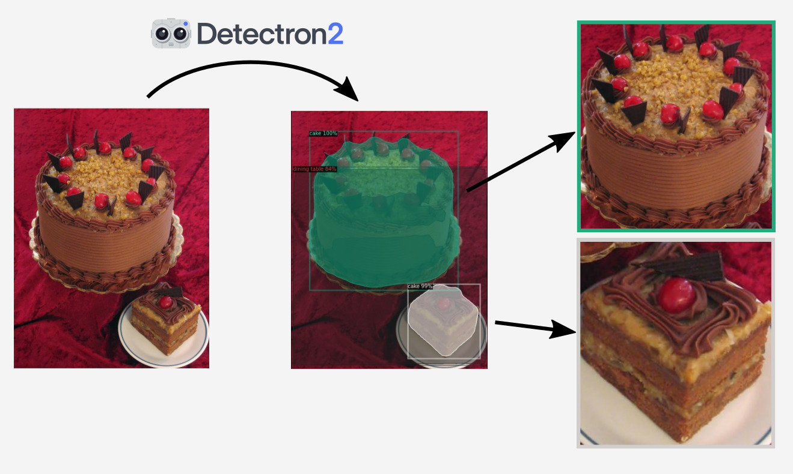
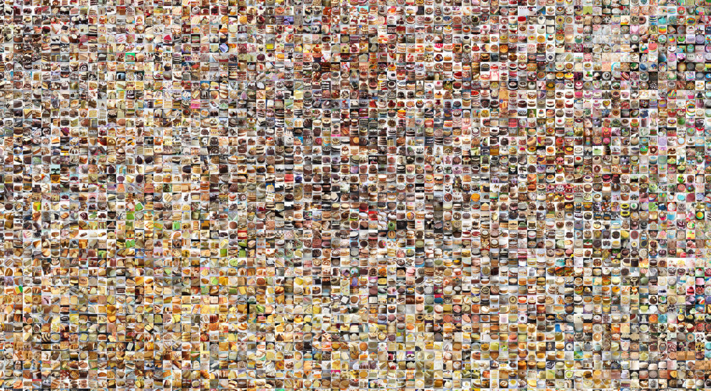

These cakes are a lie, they're all generated by a neural network.

<video controls src="http://assets.justinpinkney.com/blog/cakegan/gridloop.mp4" loop="true" preload="auto"></video>

My grand idea is to make a bespoke cake designer (I'm in this for the latent space you know!) but before I can do that I need to train a model, let's call it CakeGAN. So here is a delightful recipe for how to bake your very own non-existant cakes.

# How to bake a CakeGAN

## Ingredients

- __Data__ - 40,000+ images of cakes of all varieties cut into equal bite-sized pieces
- __Architecture__ - StyleGAN 2
- __Code__ - [My StyleGAN2 fork](https://github.com/justinpinkney/stylegan2)
- __Compute__ - A powerful GPU (Google Colab will do just fine)

## Method

### Collect your data

Scraping an image search engine is a pretty easy way of assembling a pretty huge, but low quality dataset. I used [this Bing image search scraper](https://github.com/ultralytics/google-images-download) (the google one seemed to be broken at the time) to grab a bunch of images for every search term I could think of relating to cakes. After a little time I had many GBs of (mostly) cake images on my hard drive. 

That's the raw material assembled, but it's going to need some refinement first.

### Prepare your data

The images you get back will probably be a pretty mixed bag
    
    EXAMPLE?

In their raw form they're not really suitable for training StyleGAN, in particular the images need to be a fixed aspect ratio (I'm going to go for square). It's a generally accepted piece of [[Deep Learning Folklore]] that StyleGAN gives better quality results when trying to generate images which have centrally placed objects. This is perhaps partly due to the learned constant at the start of the network???

Conveniently there are a wealth of pre-trained cake detectors available! They aren't usually called that, but it happens that "cake" is one of the categories in the COCO object detection challenge, so any COCO detector can find cakes. Using the best model from [Detectron2](https://github.com/facebookresearch/detectron2) makes this a pretty easy task. 

Then sprinkle on a bit of padding, cropping, and resizing as required and that's the main ingredient ready to go, here's what it should look like:
    

### Train your model

Save as jpg, tar and upload to google drive. Then train with Google Colab. 
    
    Repo link

Training details, from scratch config-e 256x256 seconds per tick etc P100

Graphs of FID and losses

Keep training until the FID no longer improves, or a skewer inserted comes out clean. As training progresses the FID will start to decrease very slowly, it's also quite noisy so can be a little bit hard to tell when it's worth stopping. The best FID I got was 13.6 after the model had seen around 5 million images.
    
The recent paper by Karras et al. also suggests another possible metric that indicates when the discriminator is starting to overfit. 

### Serving

Once we've the model has cooled it should be serving up some delicious interpolation videos. But the best part of a well baked GAN is the smooth and creamy latent space. For a start StyleGAN is famous (in part) for its style mixing capabilities, so let's mix some cakes.

If I want to make a cake editor I need to try and find meaningful directions in the latent space. I've got a dataset with some noisy labels I could try and use, but for a first pass using GANspace is a quick and easy way of trying to automatically find meaningful directions.

HERE ARE SOME RESULTS
