__TLDR: If you want a Colab Notebook to toonify yourself click here:__

In a [[stylegan-network-blending:previous post]] I introduced the idea of __Layer Swapping__ (or more generally network blending) for StyleGAN models. I briefly pointed to a fantastic model created by [Doron Adler](https://linktr.ee/Norod78) that generates almost photo-realistc people who seem to have come straight out of your favourite Disney/Pixar/Dreamworks animated movie.

<Tweet tweetLink="Norod78/status/1297513475258953728" />

## How to make a photo-realistic cartoon model

So what's going on here? This blended network is actually the product of a rather convoluted process which I'll try and briefly explain.

### Transfer learning

We start with the classic StyleGAN model which is trained on photos of people's faces. This was released with the StyleGAN2 code and paper and produces pretty fantastically high quality results. 

Not everyone has multiple-GPUs and weeks of time to train a model so a shortcut lots of people is called transfer learning, where they take this "pre-trained model" and then train it on some new data. This gives good results really quickly, and even more so if the new dataset is some also of faces.

Doron fine-tuned the faces model on a dataset of various characters from animated films. It's only around 300 images but enough for the model to start learning what features these characters typically have.

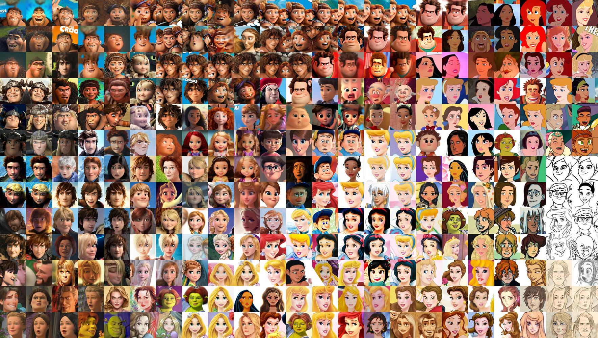

Once the model is trained just a little bit it gives outputs that look like below

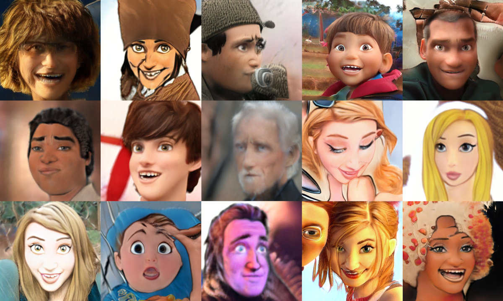

The output is OK for such a small amount of training on a small dataset, it's clearly got the big eyes thing down pretty well. The problem is that the style of images in the dataset is a bit of a mish-mash, some are CG some are hand drawn, and lots are quite low resolution. The model tries to replicate all these things and comes off worse for it.

### Blend the models

But as this model was fine tuned from the original faces model, we can perform a trick where we directly [[stylegan-network-blending:swap parts of the models]] around. This gets interesting because, due to the structure of StyleGAN,  different layers in the model affect the appearance in different ways. So low resolution layers affect the pose of the head and shape of the face, while high resolution layers control things like lighting and texture. When Doron used my layer swapping script ([Colab here](https://colab.research.google.com/drive/1tputbmA9EaXs9HL9iO21g7xN7jz_Xrko?usp=sharing)) to take the high resolution layers from the original model, and the low resolution from his fine-tuned cartoon model. You end up with a hybrid which has the structure of a cartoon face, but photo realistic rendering!

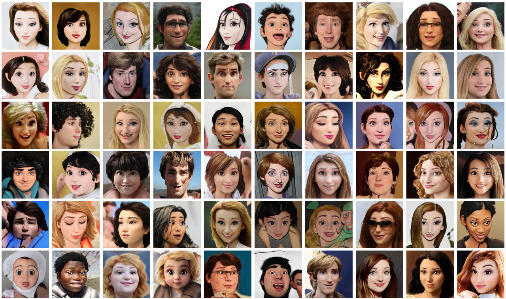

If you generate images using the original faces model and the blended cartoon model, you can see how there is a clear relationship between the two, the identities appear to be the same, but the features have been shifted to give them a cartoon look.

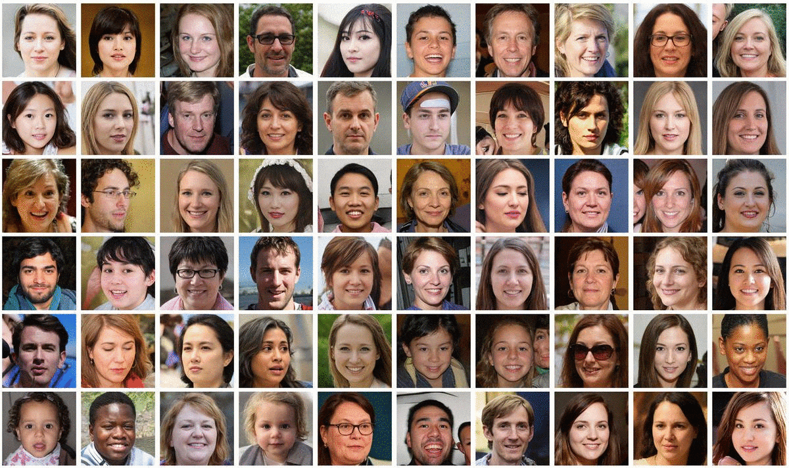

## Now toonify yourself

These StyleGAN face models can produce a huge diversity of faces and it's actually possible to find basically any face inside the model. It's actually a straight forward process to search for any image of a face in the model. So given an example image you want to find you can find a "code" (aka latent vector) which, when given as an input to the model, will produce an output which looks almost exactly like the face you're looking for. Below the original is on the left, and the generated image on the right (it's hard to tell right!?)

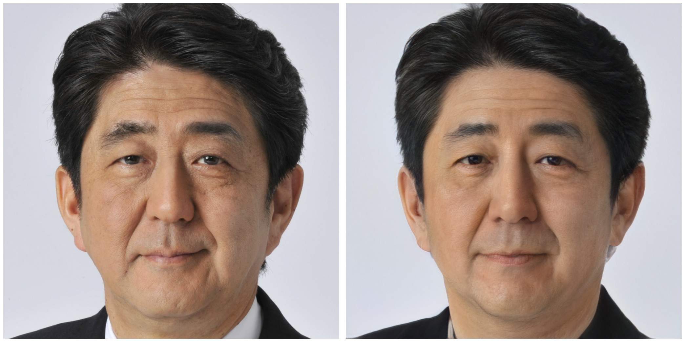

Now you have a code that represents a face, you can give this as input to the blended model and given that they are closely related, you will get the same face, but modified to look like a "toon" version!

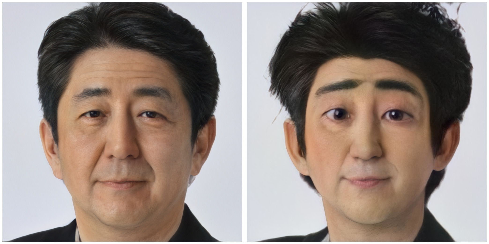

If you want to try this process yourself you can use [this colab notebook](https://colab.research.google.com/drive/1s2XPNMwf6HDhrJ1FMwlW1jl-eQ2-_tlk?usp=sharing).

BTW all credit to [Doron](https://twitter.com/Norod78) for making the model and showing this self toonification works wonderfully!

## More examples

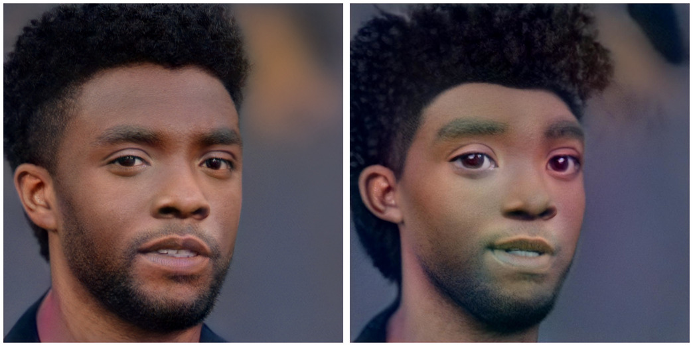
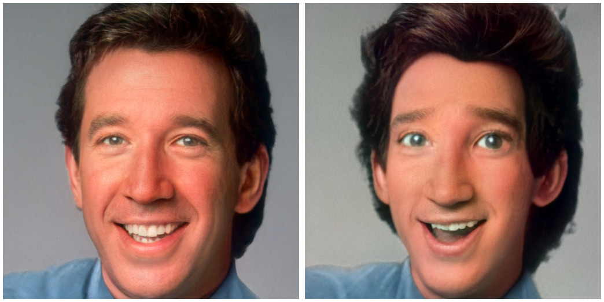
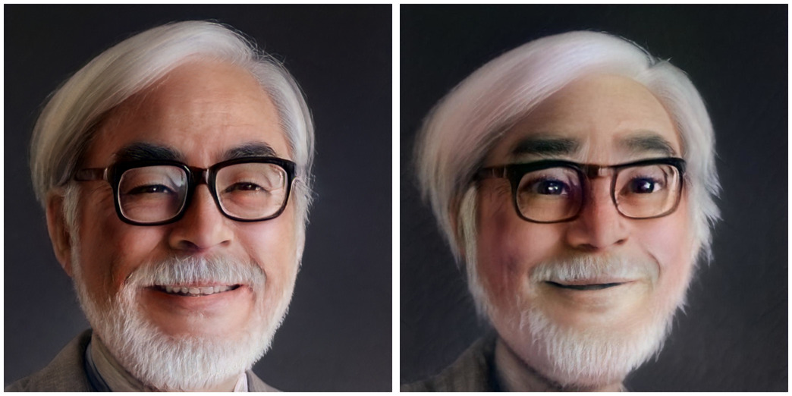
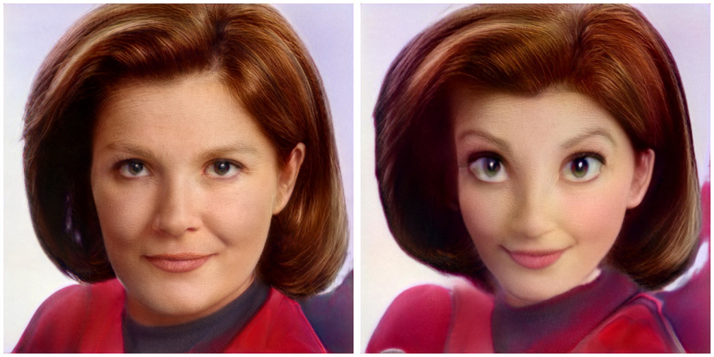
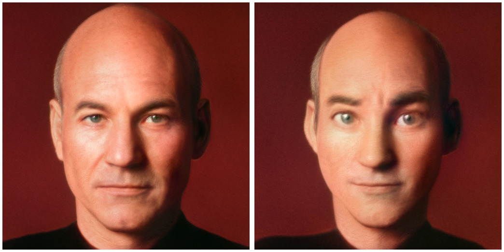
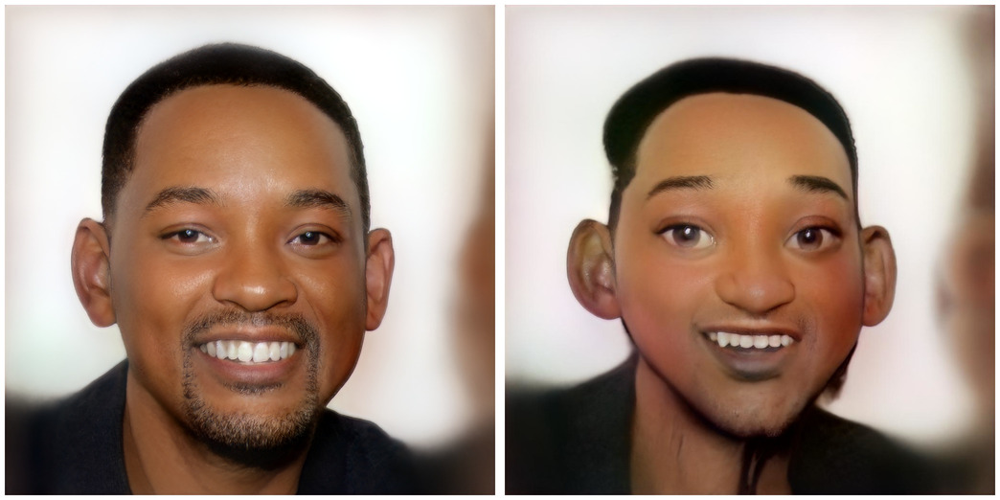
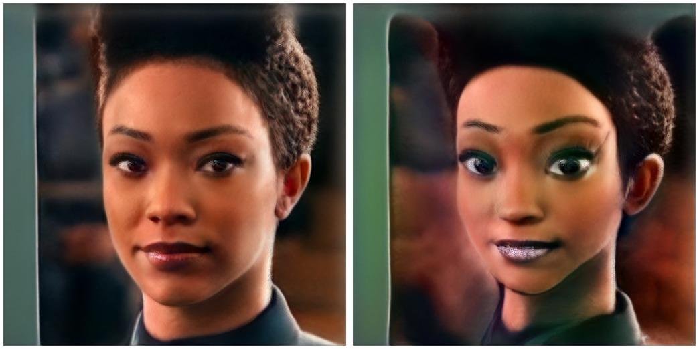
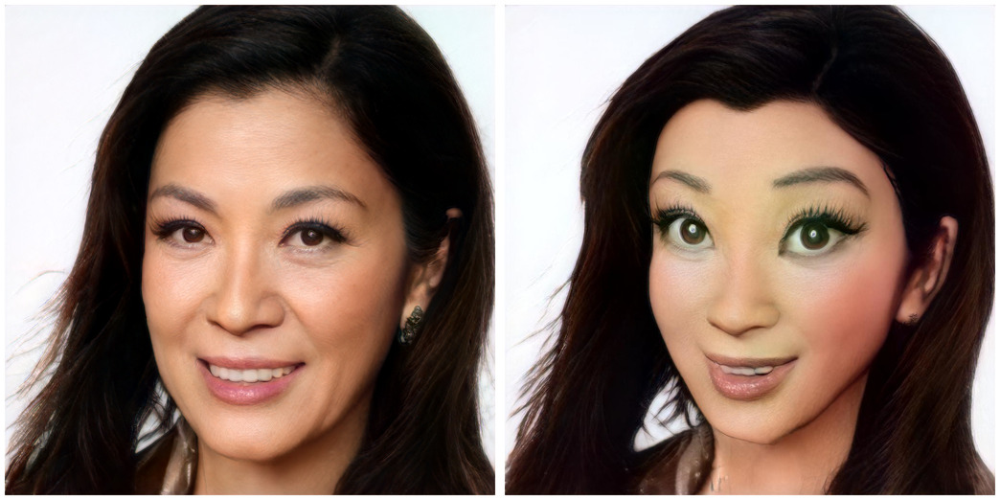
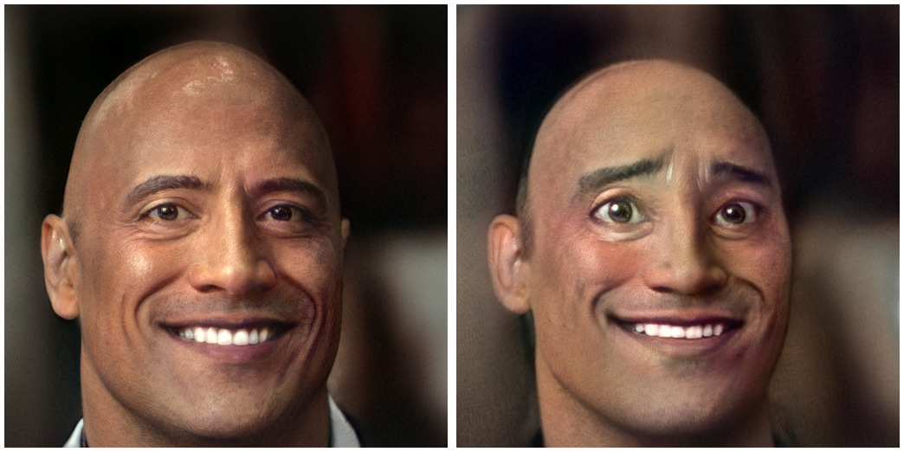
